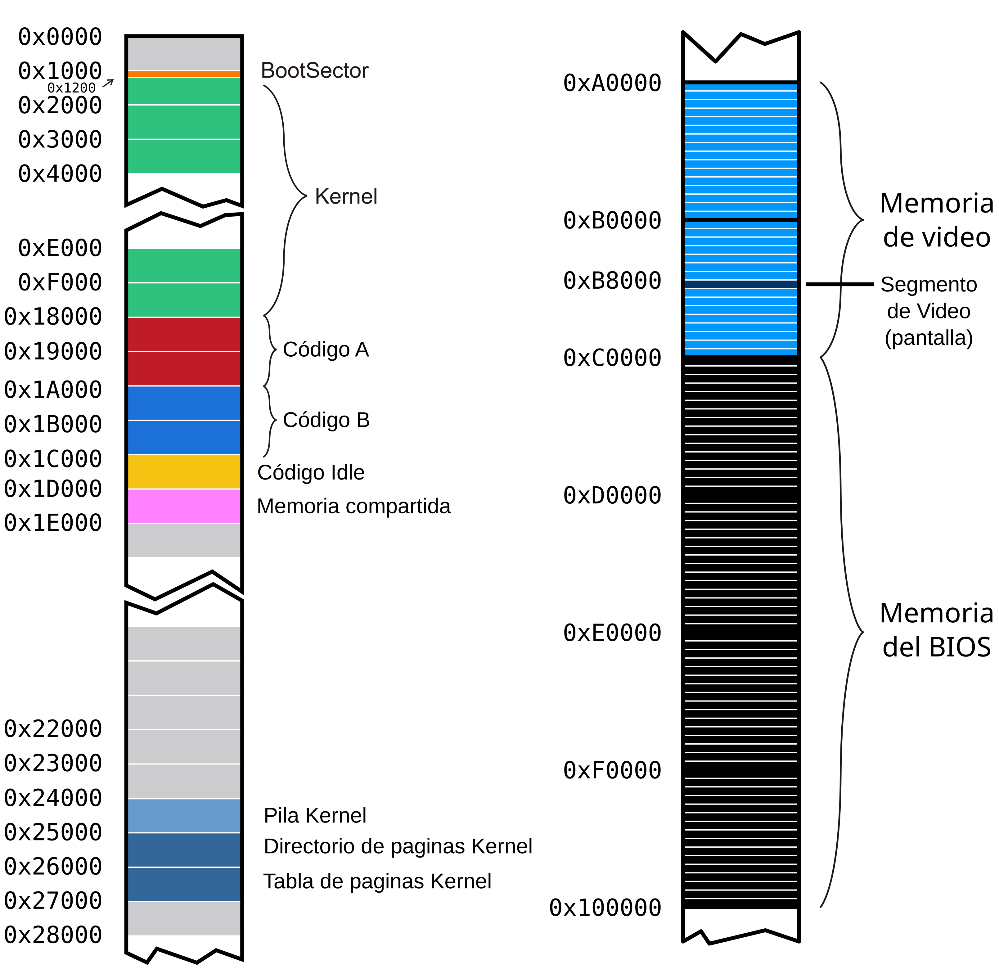

# System Programming: Tareas.

Vamos a continuar trabajando con el kernel que estuvimos programando en
los talleres anteriores. La idea es incorporar la posibilidad de
ejecutar algunas tareas específicas. Para esto vamos a precisar:

-   Definir las estructuras de las tareas disponibles para ser
    ejecutadas

-   Tener un scheduler que determine la tarea a la que le toca
    ejecutase en un período de tiempo, y el mecanismo para el
    intercambio de tareas de la CPU

-   Iniciar el kernel con una *tarea inicial* y tener una *tarea idle*
    para cuando no haya tareas en ejecución

Recordamos el mapeo de memoria con el que venimos trabajando. Las tareas
que vamos a crear en este taller van a ser parte de esta organización de
la memoria:




## Archivos provistos

A continuación les pasamos la lista de archivos que forman parte del
taller de hoy junto con su descripción:

-   **Makefile** - encargado de compilar y generar la imagen del
    floppy disk.

-   **idle.asm** - código de la tarea Idle.

-   **shared.h** -- estructura de la página de memoria compartida

-   **tareas/syscall.h** - interfaz para realizar llamadas al sistema
    desde las tareas

-   **tareas/task_lib.h** - Biblioteca con funciones útiles para las
    tareas

-   **tareas/task_prelude.asm**- Código de inicialización para las
    tareas

-   **tareas/taskPong.c** -- código de la tarea que usaremos
    (**tareas/taskGameOfLife.c, tareas/taskSnake.c,
    tareas/taskTipear.c **- código de otras tareas de ejemplo)

-   **tareas/taskPongScoreboard.c** -- código de la tarea que deberán
    completar

-   **tss.h, tss.c** - definición de estructuras y funciones para el
    manejo de las TSSs

-   **sched.h, sched.c** - scheduler del kernel

-   **tasks.h, tasks.c** - Definición de estructuras y funciones para
    la administración de tareas

-   **isr.asm** - Handlers de excepciones y interrupciones (en este
    caso se proveen las rutinas de atención de interrupciones)

-   **task\_defines.h** - Definiciones generales referente a tareas

## Ejercicios

Antes de comenzar, vamos a actualizar el archivo `isr.asm` con algunas syscalls adicionales.

- Reemplazar el código de la `isr88` por
```
pushad
push eax
call tasks_syscall_draw
add esp, 4
popad
iret
```
Esta va a ser una syscall para que una tarea dibuje en su pantalla ¿Cuál es la convención de pasaje de parámetros para esta syscall?

- Verificar que su rutina de atención para las interrupciones del teclado sea funcionalmente igual a esta:
```
pushad
; 1. Le decimos al PIC que vamos a atender la interrupción
call pic_finish1
; 2. Leemos la tecla desde el teclado y la procesamos
in al, 0x60
push eax
call tasks_input_process
add esp, 4
popad
iret
```

- Verificar que la rutina de atención para los pagefault que escribieron el el taller anterior tenga esta forma (recuerden incluir la parte que implementaron para la página compartida a demanda):
```
;; Rutina de atención de Page Fault
;; -------------------------------------------------------------------------- ;;
global _isr14

_isr14:
	; Estamos en un page fault.
	pushad
    ; COMPLETAR: llamar rutina de atención de page fault, pasandole la dirección que se intentó acceder
    .ring0_exception:
	; Si llegamos hasta aca es que cometimos un page fault fuera del area compartida.
    call kernel_exception
    jmp $

    .fin:
	popad
	add esp, 4 ; error code
	iret
```

### Primera parte: Inicialización de tareas

**1.** Si queremos definir un sistema que utilice sólo dos tareas, ¿Qué
nuevas estructuras, cantidad de nuevas entradas en las estructuras ya
definidas, y registros tenemos que configurar?¿Qué formato tienen?
¿Dónde se encuentran almacenadas?

---

**Res:**

Habría que crear/configurar un `scheduler` que vaya alternando entre las 2 tareas. Agregar 2 `tss` para guardar el contexto de cada tarea. Luego, configuar el sistema de paginación para cada tarea con sus respectivos `page directory` y `page table`. También 2 entradas nuevas en la `gdt` que apunten a la `tss` de cada tarea. Finalmente, utilizar el registro `TR` para almacenar el selector de tss que se este usando actualmente. 

---

**2.** ¿A qué llamamos cambio de contexto? ¿Cuándo se produce? ¿Qué efecto
tiene sobre los registros del procesador? Expliquen en sus palabras que
almacena el registro **TR** y cómo obtiene la información necesaria para
ejecutar una tarea después de un cambio de contexto.

---

**Res:**

Llamamos cambio de contexto cuando se deja de ejecutar una tarea para pasar a otra, guardando su contexto en la `tss` y cargando el contexto de la tarea a ejecutar. Esto se produce cada vez que hay una interrupción de reloj, donde le pide al scheduler la siguiente tarea a ejecutar. 
El efecto que tiene sobre los registros del procesador es que estos son los que contienen el contexto de la tarea, entonces cuando se cambia de contexto los valores de los registros se guardan en la `tss`.
Lo que almacena el registro `TR` es el selector de segmento de la tarea que estamos ejecutando, se utiliza para ir a la `gdt` y obtener el descriptor de la `tss`. 

---

**3.** Al momento de realizar un cambio de contexto el procesador va
almacenar el estado actual de acuerdo al selector indicado en el
registro **TR** y ha de restaurar aquel almacenado en la TSS cuyo
selector se asigna en el *jmp* far. ¿Qué consideraciones deberíamos
tener para poder realizar el primer cambio de contexto? ¿Y cuáles cuando
no tenemos tareas que ejecutar o se encuentran todas suspendidas?

---

**Res:**

Las consideraciones que hay que tener para un cambio de contexto es pasar de la `tarea inicial` a la `tarea idle`, teniendo ya configurado la `tss` y el descriptor de la `tss` de la tarea idle.
Cuando no hay tareas el `scheduler` pasa a la `tarea idle` hasta que se reanude o se inicie la ejecución de otra tarea.

---

**4.** ¿Qué hace el scheduler de un Sistema Operativo? ¿A qué nos
referimos con que usa una política?

---

**Res:**

El `scheduler` es el que se encarga de decidir que tarea se va a ejecutar en cada tick de reloj, mediante una política que decide que tarea elegir. Cuando se usa política nos referimos a que se utiliza un conjunto de criterios que le indica al `scheduler` cual tarea va a ser la próxima en ejecutarse.

---

**5.** En un sistema de una única CPU, ¿cómo se hace para que los
programas parezcan ejecutarse en simultáneo?

---

**Res:**

Los programas parecen ejecutarse en simultáneo ya que los cambios de tarea se hacen a una velocidad imperceptible para el ojo humano.

---

**6.** En **tss.c** se encuentran definidas las TSSs de la Tarea
**Inicial** e **Idle**. Ahora, vamos a agregar el *TSS Descriptor*
correspondiente a estas tareas en la **GDT**.
    
a) Observen qué hace el método: ***tss_gdt_entry_for_task***

b) Escriban el código del método ***tss_init*** de **tss.c** que
agrega dos nuevas entradas a la **GDT** correspondientes al
descriptor de TSS de la tarea Inicial e Idle.

c) En **kernel.asm**, luego de habilitar paginación, agreguen una
llamada a **tss_init** para que efectivamente estas entradas se
agreguen a la **GDT**.

d) Correr el *qemu* y usar **info gdt** para verificar que los
***descriptores de tss*** de la tarea Inicial e Idle esten
efectivamente cargadas en la GDT

**7.** Como vimos, la primer tarea que va a ejecutar el procesador
cuando arranque va a ser la **tarea Inicial**. Se encuentra definida en
**tss.c** y tiene todos sus campos en 0. Antes de que comience a ciclar
infinitamente, completen lo necesario en **kernel.asm** para que cargue
la tarea inicial. Recuerden que la primera vez tenemos que cargar el registro
**TR** (Task Register) con la instrucción **LTR**.
Previamente llamar a la función tasks_screen_draw provista para preparar
la pantalla para nuestras tareas.

Si obtienen un error, asegurense de haber proporcionado un selector de
segmento para la tarea inicial. Un selector de segmento no es sólo el
indice en la GDT sino que tiene algunos bits con privilegios y el *table
indicator*.

**8.** Una vez que el procesador comenzó su ejecución en la **tarea Inicial**, 
le vamos a pedir que salte a la **tarea Idle** con un
***JMP***. Para eso, completar en **kernel.asm** el código necesario
para saltar intercambiando **TSS**, entre la tarea inicial y la tarea
Idle.

**9.** Utilizando **info tss**, verifiquen el valor del **TR**.
También, verifiquen los valores de los registros **CR3** con **creg** y de los registros de segmento **CS,** **DS**, **SS** con
***sreg***. ¿Por qué hace falta tener definida la pila de nivel 0 en la
tss?

---

**Res:**

Hace falta definir la pila de nivel 0 en la `tss` ya que de otra manera no se podría volver a encontrar la pila de kernel de una tarea. Siendo esto importante para poder restaurar el contexto de la tarea con la instrucción `popad` al final de la interrupción de reloj.

---

**10.** En **tss.c**, completar la función ***tss_create_user_task***
para que inicialice una TSS con los datos correspondientes a una tarea
cualquiera. La función recibe por parámetro la dirección del código de
una tarea y será utilizada más adelante para crear tareas.

Las direcciones físicas del código de las tareas se encuentran en
**defines.h** bajo los nombres ***TASK_A_CODE_START*** y
***TASK_B_CODE_START***.

El esquema de paginación a utilizar es el que hicimos durante la clase
anterior. Tener en cuenta que cada tarea utilizará una pila distinta de
nivel 0.

### Segunda parte: Poniendo todo en marcha

**11.** Estando definidas **sched_task_offset** y **sched_task_selector**:
```
  sched_task_offset: dd 0xFFFFFFFF
  sched_task_selector: dw 0xFFFF
```

Y siendo la siguiente una implementación de una interrupción del reloj:

```
global _isr32
  
_isr32:
  pushad
  call pic_finish1 ;avisa al pic que estamos atendiendo la interrupción
  
  call sched_next_task ;pedimos al scheduler la siguiente tarea a ejecutar
  
  str cx ;carga en cx el tr de la tarea actual
  cmp ax, cx ;compara el tr con el que nos devolvió el scheduler
  je .fin ;si son iguales no ocurre nada más
  
  mov word [sched_task_selector], ax ;se setea la próxima tarea a ejecutar
  jmp far [sched_task_offset] ;se hace el salto a la tarea a ejecutar (cambio de contexto)
  
  .fin:
  popad
  iret
```
a)  Expliquen con sus palabras que se estaría ejecutando en cada tic
    del reloj línea por línea

b)  En la línea que dice ***jmp far \[sched_task_offset\]*** ¿De que
    tamaño es el dato que estaría leyendo desde la memoria? ¿Qué
    indica cada uno de estos valores? ¿Tiene algún efecto el offset
    elegido?

---

**Res:**

El tamaño del dato que se lee desde la memoria es de 16bits, que indíca que selector de la `gdt` obtener para conseguir la `tss` de la tarea a ejecutarse.
El offset no tiene ningún efecto.

---

c)  ¿A dónde regresa la ejecución (***eip***) de una tarea cuando
    vuelve a ser puesta en ejecución?

---

**Res:**

Regresa a apuntar a la intrucción `popad` de la interrupción del reloj.

---

d)  Reemplazar su implementación anterior de la rutina de atención de reloj por la provista.

**12.** Para este Taller la cátedra ha creado un scheduler que devuelve
la próxima tarea a ejecutar.

a)  En los archivos **sched.c** y **sched.h** se encuentran definidos
    los métodos necesarios para el Scheduler. Expliquen cómo funciona
    el mismo, es decir, cómo decide cuál es la próxima tarea a
    ejecutar. Pueden encontrarlo en la función ***sched_next_task***.

---

**Res:**

Se fija la siguiente tarea después de la actual que se pueda ejecutar (TASK_RUNNABLE) y devuelve su selector, si no encuentra ninguna devuelve el selector de la tarea idle.

---

b)  Modifiquen **kernel.asm** para llamar a la función
    ***sched_init*** luego de iniciar la TSS

c)  Compilen, ejecuten ***qemu*** y vean que todo sigue funcionando
    correctamente.

### Tercera parte: Tareas? Qué es eso?

**14.** Como parte de la inicialización del kernel, en kernel.asm se
pide agregar una llamada a la función **tasks\_init** de
**task.c** que a su vez llama a **create_task**. Observe las
siguientes líneas:
```C
int8_t task_id = sched_add_task(gdt_id << 3);

tss_tasks[task_id] = tss_create_user_task(task_code_start[tipo]);

gdt[gdt_id] = tss_gdt_entry_for_task(&tss_tasks[task_id]);
```
a)  ¿Qué está haciendo la función ***tss_gdt_entry_for_task***?

---

**Res:**
Te devuelve el descriptor de la `gdt` para la `tss` de la tarea.

---

b)  ¿Por qué motivo se realiza el desplazamiento a izquierda de
    **gdt_id** al pasarlo como parámetro de ***sched_add_task***?

---

**Res:**

El `sched_add_task` toma un selector de segmento, al shiftear el index se obtiene un selector válido con `TI` y `RPL` en 0.

---

**15.** Ejecuten las tareas en *qemu* y observen el código de estas
superficialmente.

a) ¿Qué mecanismos usan para comunicarse con el kernel?

---

**Res:**
El mecanismo que utilizan para comunicarse es mediante `syscalls` y colocando valores en al memoria compartida para que puedan ser leídos mediante otras tareas y/o el kernel

---

b) ¿Por qué creen que no hay uso de variables globales? ¿Qué pasaría si
    una tarea intentase escribir en su `.data` con nuestro sistema?

---

**Res:**

La razón es que cualquier tarea podría acceder a este valor y sobreescribirlo. Si la tarea intenta acceder a su `.data`, esta no podría por las políticas de protección de memoria del kernel.

---

c) Cambien el divisor del PIT para \"acelerar\" la ejecución de las tareas:
```
    ; El PIT (Programmable Interrupt Timer) corre a 1193182Hz.

    ; Cada iteracion del clock decrementa un contador interno, cuando
    éste llega

    ; a cero se emite la interrupción. El valor inicial es 0x0 que
    indica 65536,

    ; es decir 18.206 Hz

    mov ax, DIVISOR

    out 0x40, al

    rol ax, 8

    out 0x40, al
```

**16.** Observen **tareas/task_prelude.asm**. El código de este archivo
se ubica al principio de las tareas.

a. ¿Por qué la tarea termina en un loop infinito?

---

**Res:**

Termina en loop infinito porque no existe lógica de terminación de una tarea.

---

b. \[Opcional\] ¿Qué podríamos hacer para que esto no sea necesario?

### Cuarta parte: Hacer nuestra propia tarea

Ahora programaremos nuestra tarea. La idea es disponer de una tarea que
imprima el *score* (puntaje) de todos los *Pongs* que se están
ejecutando. Para ello utilizaremos la memoria mapeada *on demand* del
taller anterior.

#### Análisis:

**18.** Analicen el *Makefile* provisto. ¿Por qué se definen 2 "tipos"
de tareas? ¿Como harían para ejecutar una tarea distinta? Cambien la
tarea S*nake* por una tarea *PongScoreboard*.

---

**Res:**

Se definen 2 tipos de tareas porque queremos que nuestro programa ejecute nada más estas 2 tareas en simultáneo.

---

**19.** Mirando la tarea *Pong*, ¿En que posición de memoria escribe
esta tarea el puntaje que queremos imprimir? ¿Cómo funciona el mecanismo
propuesto para compartir datos entre tareas?

---

**Res:**

Escribe en la posición PAGE_ON_DEMAND_BASE_VADDR + 0xF00 que se encuentra en la página ON_DEMAND.
El mecanismo funciona tal que al estar este puntaje en la página ON_DEMAND caulquier tarea puede acceder a esa posición de memoria.

---

#### Programando:

**20.** Completen el código de la tarea *PongScoreboard* para que
imprima en la pantalla el puntaje de todas las instancias de *Pong* usando los datos que nos dejan en la página compartida.

**21.** \[Opcional\] Resuman con su equipo todas las estructuras vistas
desde el Taller 1 al Taller 4. Escriban el funcionamiento general de
segmentos, interrupciones, paginación y tareas en los procesadores
Intel. ¿Cómo interactúan las estructuras? ¿Qué configuraciones son
fundamentales a realizar? ¿Cómo son los niveles de privilegio y acceso a
las estructuras?

**22.** \[Opcional\] ¿Qué pasa cuando una tarea dispara una
excepción? ¿Cómo podría mejorarse la respuesta del sistema ante estos
eventos?
